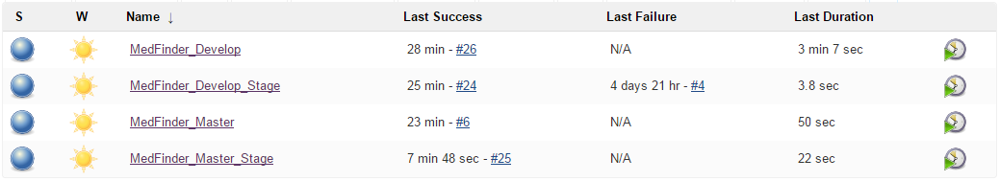
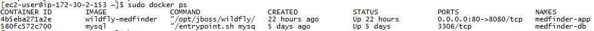

# Continuous Integration and Deployment

Harmonia uses an internally hosted Jenkins as our continuous integration platform. We use the [Git Flow Workflow](https://www.atlassian.com/git/tutorials/comparing-workflows/gitflow-workflow) model within our Git repository which provides two main branches named develop and master. The develop branch is where developers commit code as they work towards the next release. The master branch holds the latest released version of the code along with tags for previous versions. Any release can always be built from the master branch. We configured four Jenkins jobs for MedFinder seen below.
 
 
 
The [MedFinder\_Develop job](MedFinder_Develop%20%5bJenkins%5d.pdf) compiles the application code from the develop branch into a deployable WAR file along with running unit tests and static code analysis tools. The page shows the charts produced from the static code analysis tools like FindBugs and PMD (to detect any code exhibiting NIST’s Common Weakness Enumeration), warnings from Java and JavaDoc, unit test results, and [unit test code coverage](../Unit_Tests/MedFinder%20Unit%20Test%20Coverage.pdf).

The [MedFinder\_Develop\_Stage job](MedFinder_Develop_Stage%20[Jenkins].pdf) runs automatically upon a successful build of *MedFinder_Develop*. It deploys the WAR file to the stage server.

The [MedFinder\_Master job](MedFinder_Master%20[Jenkins].pdf) performs the same activities as the *MedFinder_Develop* build but for the master branch.

The [MedFinder\_Master\_Stage job](MedFinder_Master_Stage%20[Jenkins].pdf) runs automatically upon a successful build of *MedFinder_Master*. It deploys the WAR file to the production server, which is the [Amazon Web Services (AWS) instance](MedFinder%20AWS%20Instance.pdf).

# Container Deployment

Harmonia deployed MedFinder using Docker, which is a platform that enables rapid deployment of applications in isolation from other applications on a system.
See the [configuration files](../../docker) used to support the deployment and the [installation procedure](MedFinder%20-%20Installation%20Procedure.docx).

The figure beow is a screenshot showing the output of the docker ps command which lists the running containers. The first container named *medfinder-app* contains a Wildfly instance in which the MedFinder application is deployed. The second container named *medfinder-db* contains the MySQL database.

 